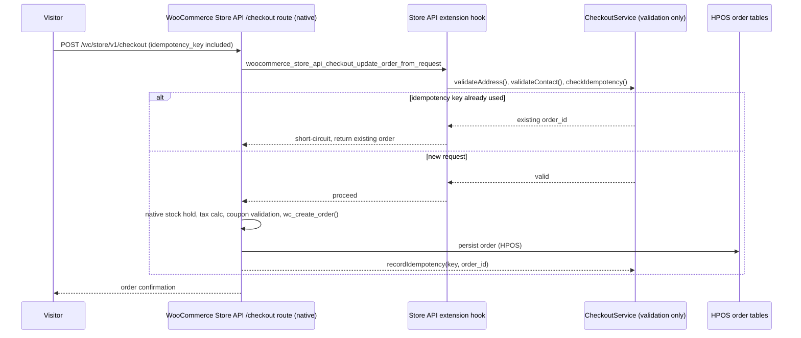
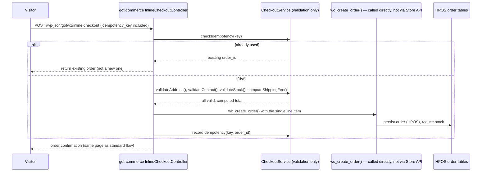
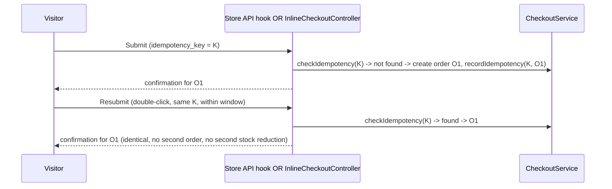
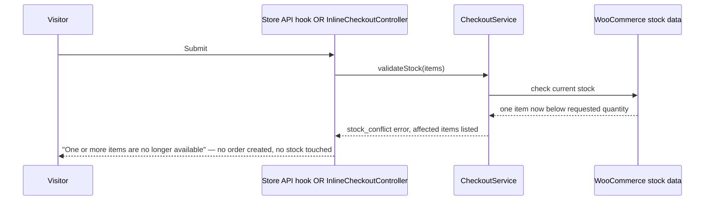

# Checkout and Order Lifecycle (Corrected Architecture)

**Status**: Supersedes the checkout-mechanism description in `docs/architecture/checkout-flow.md` and ADR 0005/0006 wherever they conflict with this document. Written in response to a CONFIRMED DEFECT found by an independent Codex architecture review (`docs/planning/PRE-IMPLEMENTATION-ARCHITECTURE-REMEDIATION.md` finding C2-CHECKOUT): the prior design implied `CheckoutService::createOrder()` sits **between** the WooCommerce Store API's `/checkout` route and `wc_create_order()`, intercepting and replacing WooCommerce's own order-creation pipeline for the standard (cart-based) flow. That is not WooCommerce's documented extension pattern and risks bypassing hooks WooCommerce's own checkout processing (and any future third-party plugin) expects to fire — stock holds, tax calculation, coupon validation, draft-order updates.

## The corrected model: one shared validator, two different order-creation callers

**`CheckoutService` is renamed in role (not necessarily in class name) to be a shared validation/idempotency helper, not an order-creation intercept layer.** It is called differently by each of the two checkout entry points, because they have genuinely different relationships to WooCommerce's cart:

| | Standard checkout (Feature 010) | Inline PDP checkout (Feature 009) |
|---|---|---|
| Has a real WooCommerce cart session? | Yes — the visitor's actual cart | No, by design (ADR 0006 — must never touch the visitor's real cart) |
| Who creates the order? | **WooCommerce's own Store API `/checkout` route**, native, unmodified in its own internal order-creation call | `got-commerce`'s thin controller, calling `wc_create_order()` **directly** — a supported, documented WooCommerce API, not Store-API-internal |
| How does GØT-specific validation (Egyptian phone format, shipping-zone coverage, idempotency) get applied? | Via **documented Store API extension hooks** (`woocommerce_store_api_checkout_update_order_from_request`, Store API's `ExtendSchema`/`StoreApi` field-registration and validation hooks) calling into `CheckoutService`'s validation methods | By calling `CheckoutService`'s validation methods directly before calling `wc_create_order()` itself |
| Who computes the total? | WooCommerce's own checkout processing (cart totals, already server-authoritative) | `CheckoutService`, performing the identical calculation logic WooCommerce's cart would — same shipping-zone lookup, same stock check |

**What `CheckoutService` actually contains now** (its real, corrected responsibility):
- `validateAddress(governorate, city, street, building)` — shared Egyptian-address/shipping-zone-coverage check, used by both flows.
- `validateContact(name, phone, email)` — shared Egyptian phone-format validation, used by both flows.
- `computeShippingFee(governorate, items)` — shared shipping-zone fee lookup, used by both flows (010 calls this from inside a Store API hook; 009 calls it directly before creating its own order).
- `checkIdempotency(idempotencyKey)` / `recordIdempotency(idempotencyKey, orderId)` — the shared idempotency guard (see below), used by both flows.
- `validateStock(items)` — shared stock re-check, used by both flows.

**What `CheckoutService` no longer does**: it does not itself call `wc_create_order()` for the standard checkout flow — WooCommerce's Store API route does that natively. It **does** get called *by* Feature 009's controller to perform validation, and Feature 009's controller itself then calls `wc_create_order()` directly (since 009 has no cart/Store-API session to hand that responsibility to).

This reconciliation keeps ADR 0006's actual goal intact — **one shared implementation of every validation rule, never two** — without the architectural problem Codex found, which was specifically about *order creation*, not about *validation logic sharing*.

## Idempotency ordering fix (the second part of finding C2-CHECKOUT)

The prior task list had `CheckoutService::createOrder()` (Feature 010 T006) listed as requiring "an idempotency check" while the component that implements idempotency (`IdempotencyGuard.php`) was a separate, later task (T023) — i.e., T006 depended on something that didn't exist yet in the task sequence. **Fixed**: `IdempotencyGuard`'s implementation moves to Phase 2 (Foundational), immediately after the table migration and before any validation method that depends on it — see the updated `specs/010-cart-standard-checkout/tasks.md`.

## Sequence diagrams

### 1. Standard COD checkout (corrected)

### 2. Inline PDP COD checkout (unchanged in spirit, clarified in detail)

### 3. Duplicate submission (either flow)

### 4. Stock conflict

### 5. Shipping/tax/coupon recalculation

Standard flow: entirely native WooCommerce cart/checkout recalculation — triggered automatically on every cart mutation, unchanged from WooCommerce's own behavior, which is exactly why Feature 010 should not shadow it with a custom calculation path.
Inline flow: `CheckoutService::computeShippingFee()` is called fresh on every form change (governorate selection), never cached from a prior render.

### 6. Order confirmation and transactional email

Both flows converge on the same point once an order exists: WooCommerce's native `woocommerce_order_status_changed`/`woocommerce_new_order` hooks fire the confirmation email (Feature 013), and both redirect to the same `thankyou.php` template (Feature 013), keyed by the real order ID and WooCommerce's native order-access key — never a client-asserted "success" flag.

### 7. Checkout failure and recovery

Both flows: on any validation failure or an unexpected server error, no order is created, no stock is touched, and the visitor's cart (standard flow) or form inputs (inline flow) are preserved — matching the already-correct PRD-specified behavior, unaffected by this correction.

## HPOS compatibility

Unaffected by this correction — if anything, strengthened: the standard flow now relies entirely on WooCommerce's own native, HPOS-compatible order-creation path rather than a custom service re-implementing it, which removes a class of HPOS-compatibility risk the prior design carried (a custom service calling `wc_create_order()` directly is HPOS-safe in isolation, but duplicating WooCommerce's own checkout-route logic around it was the actual risk — not the HPOS call itself).
