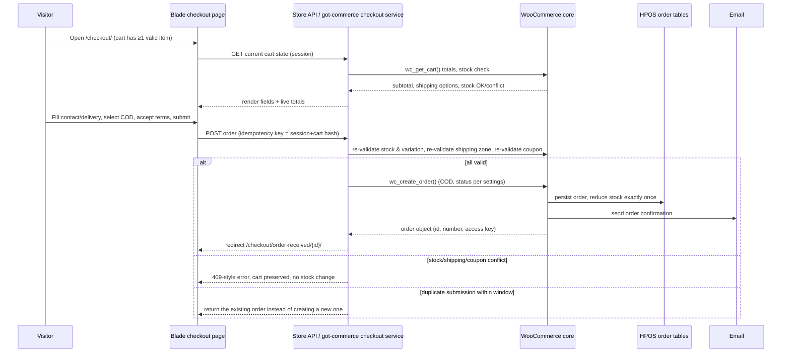
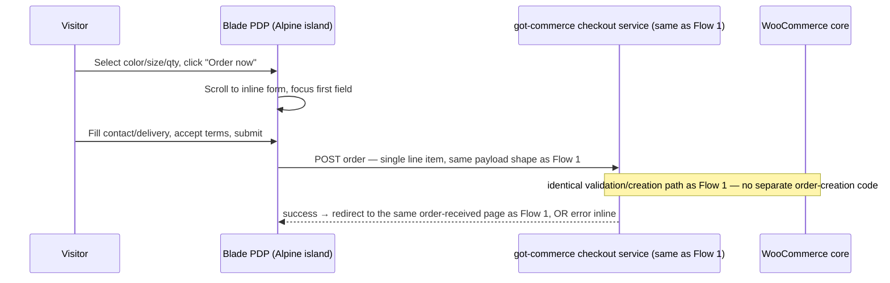

# Checkout Flow — Standard and Inline PDP (Cash on Delivery)

Status: VERIFIED for the standard-checkout flow (fully scoped in `GOT-Store-PRD.md` P0-F006) / **REQUIRES APPROVAL** for the inline-PDP flow (see `docs/audit/source-conflicts.md` C-02 — the prototype fully builds this, the PRD's feature table does not scope it). This document specifies both so implementation can proceed the moment the scope question is answered, without re-architecting.

## Non-negotiable shared rule (constitution Principles 3, 5, 6)

**There is exactly one checkout business-rule service.** Both entry points (cart→checkout page, and — if approved — PDP inline form) call the same plugin-owned service for stock/variation validation, shipping-zone lookup, coupon validation, total computation, idempotent order creation, and email dispatch. Nothing about price, stock, or shipping is ever computed twice or computed differently depending on entry point.

## Flow 1 — Standard checkout (from cart), VERIFIED scope (PRD P0-F006)

**Acceptance criteria (verbatim from PRD P0-F006):** all fields validated inline on blur + again on submit; Egyptian mobile formats `01[0125]XXXXXXXX` / `+20 1[0125]XXXXXXXX`; confirmation renders within 2s on 4G; stock reduced exactly once; repeated submission creates no duplicate order/stock change; confirmation email within 2 minutes in 99% of cases; no payment secret anywhere in page source/storage/network (moot for COD-only v1, but the architecture must not preclude adding a gateway in v2 without a redesign); checkout completes in ≤4 steps on a 390px viewport.

## Flow 2 — Inline PDP checkout, **PROPOSED, gated on owner approval** (prototype: `DirectCheckout.jsx` inside `Product.jsx`)

Identical backend service as Flow 1. The only difference is the entry point and that the "cart" being checked out is a single ad-hoc line item (the PDP's currently-selected variation + quantity), not the persisted WooCommerce session cart.

### Mechanism options compared (full comparison lives in `docs/adr/0006-inline-checkout-architecture.md`)

1. **WooCommerce Store API directly from the PDP island** — `POST /wc/store/v1/cart/add-item` (add the single selected variation) immediately followed by `POST /wc/store/v1/checkout`. Pro: zero custom endpoint, uses WooCommerce's own session/cart machinery, automatically shares validation with Flow 1. Con: briefly mutates the visitor's real cart (if they had other items in it, a naive implementation could pollute it) — needs a dedicated "ephemeral single-item session" handling detail.
2. **Custom `got-commerce` endpoint that wraps the same internal service Flow 1 uses**, without touching the visitor's persisted cart at all. Pro: cleanest separation, no cart-pollution risk. Con: one more endpoint to maintain (mitigated by both endpoints calling the *same* internal PHP service class, so there is no logic duplication, only a thin controller wrapper).
3. **Native checkout `woocommerce_checkout_process` hooks reused for both**, with the PDP form submitting into a hidden headless checkout session. Pro: maximum reuse of core checkout email/hook machinery. Con: more fragile to reason about with only one product in scope; riskier against future WooCommerce core changes.

Recommendation (PROPOSED, pending ADR sign-off): **Option 2**, because it fully satisfies "never trust client totals," never risks cart pollution, and keeps the theme/plugin boundary clean (the controller is a thin wrapper in `got-commerce/src/Checkout/`).

### Anti-fraud / duplicate-submission handling (applies to both flows)

- Server-side idempotency key derived from session + cart/line-item fingerprint + a short time window (PRD: 60 seconds) — a repeated submission within that window returns the **existing** order rather than creating a new one or erroring.
- Submit button disabled + spinner shown immediately on click (client-side UX only — not the actual protection).
- No success state is ever shown client-side until the server round-trip confirms persistence (constitution/PRD both: "never show a success state before persistence is confirmed").

## Open questions this document deliberately leaves to the ADR/owner

- Whether Flow 2 ships at all in v1 (C-02, `docs/adr/0006-inline-checkout-architecture.md`).
- Exact WooCommerce Store API route stability at build time (PRD §11.3 footnote: "paths are confirmed in Phase 2").
- Whether a logged-in customer's inline-PDP order should also attach to their account the same way a standard checkout order would — PROPOSED: yes, identical attach-by-email logic as Flow 1, no special case.
