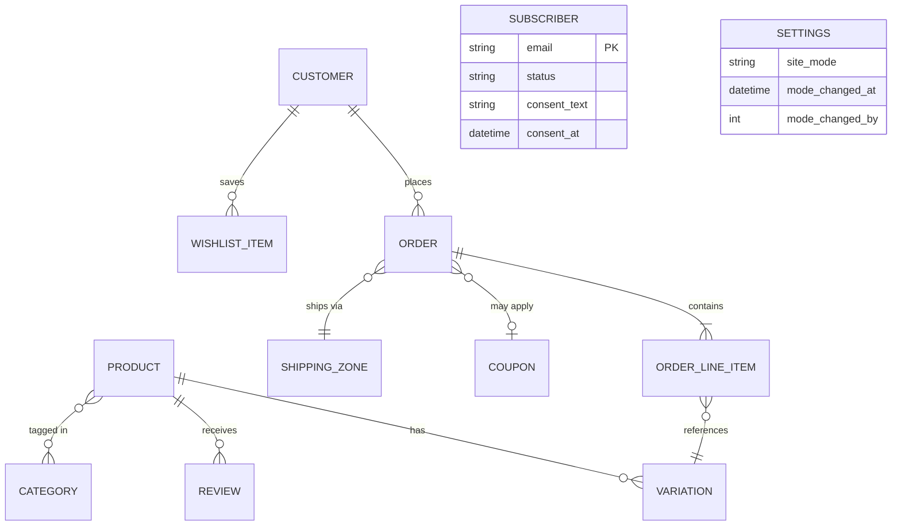

# Data Model

Status: VERIFIED (entity/field lists quoted from `GOT-Store-PRD.md` §11.4 "Data Model" and §9 "Database Architecture") merged with findings from the prototype's `data.js`/`.d.ts` contracts. PROPOSED for anything not explicitly in the PRD.

## Entity-relationship overview

## WordPress/WooCommerce-native entities (source of truth: WooCommerce core, HPOS enabled)

| Entity | Key fields (per PRD §11.4) | Storage |
|---|---|---|
| Product | id, name, slug, description, short_description, status, featured, sku, images[], category_ids[], tag_ids[], attribute_ids[] | WooCommerce product post type + taxonomies |
| Product Variation | id, product_id, size, color, regular_price, sale_price, stock_quantity, image_id, status | WooCommerce variation post type |
| Order | id, order_number, status, customer_id (nullable), billing_email, billing_address{}, shipping_address{}, shipping_method, payment_method (`cod`), line_items[], subtotal, shipping_total, discount_total, total, created_at | HPOS order tables |
| Order Line Item | product_id, variation_id, quantity, unit_price, line_total, size, color | HPOS order-item tables |
| Coupon | code, discount_type, amount, usage_limit, usage_count, expiry_date, minimum_spend, individual_use | WooCommerce coupon post type |
| Shipping Zone | zone_name, governorates[], methods[], fee_egp | WooCommerce shipping zone tables |
| Customer | id, email, first_name, last_name, phone, billing_address{}, shipping_address{}, role | `wp_users` + WooCommerce customer meta |
| Review | id, product_id, customer_id, rating (1–5), content, verified (bool), status, created_at | WooCommerce product reviews (comments table) |

## Custom/plugin-owned entities

| Entity | Fields | Storage decision | Status |
|---|---|---|---|
| Subscriber (early access) | id, email (unique), first_name, whatsapp, status (`pending/confirmed/sync_pending/unsubscribed`), consent_text, consent_at, confirmed_at, ip_hash, created_at | Custom table `got_early_access` **or** CPT **or** email-tool-only — **undecided, see `docs/adr/0010-early-access-storage.md`** | REQUIRES APPROVAL |
| Wishlist Item | user_id, product_id, variation_id, created_at | User meta (logged-in) for P1; guest = cookie/localStorage, reconciled at login — see `docs/adr/0007-wishlist-persistence.md` | PROPOSED |
| Site Mode setting | `got_site_mode` (enum: `coming_soon`\|`store`), `got_site_mode_changed_at`, `got_site_mode_changed_by` | WordPress `wp_options` (autoloaded, single row) | PROPOSED |
| Activity log entry | actor, action, timestamp, context | Either a lightweight custom table or an approved activity-log plugin (PRD §9 plugin list) — **decision deferred to implementation**, not yet an ADR (low risk, reversible choice) | PROPOSED |
| Color swatch hex (PDP `ColorSelector`) | hex value per `pa_color` attribute term | WooCommerce attribute **term meta** (`add_term_meta`) — not a new table | VERIFIED as the correct native mechanism (see `woocommerce-integration.md`) |
| Promotion/BOGO eligibility state (if approved) | offer id, type, eligibility rule, savings | Likely WooCommerce coupon + a thin plugin-side eligibility calculator, pending ADR 0009 | BLOCKED on scope decision (C-03) |

## Data NOT modeled anywhere yet (gaps carried from `docs/audit/missing-assets.md`)

- Size-guide measurement data (chest/length/sleeve per size) — needs a field (likely ACF field group on the product, or a term-meta table keyed by size) once the brand owner supplies real measurements.
- Legal policy content — modeled as ordinary WordPress Pages, not a custom entity.

## Relationships (per PRD §11.4, VERIFIED)

Product 1 → many Variations; Order 1 → many Line Items; Customer 1 → many Orders; Customer 1 → many Wishlist Items; Product 1 → many Reviews.

## What is explicitly NOT a custom entity (constitution Principle 9 — avoid unnecessary schema)

- Cart contents: WooCommerce session, not a custom table.
- Analytics events: pushed to GA4/GTM, not persisted in WordPress.
- "Recently viewed products" (P2, deferred): if built, a cookie-based list per PRD P2-F002, not a database table.
