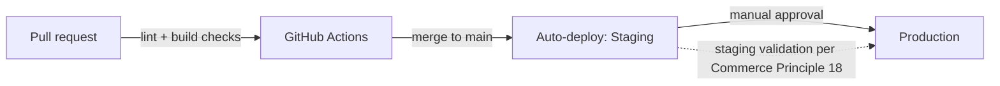

# Deployment Architecture

Status: VERIFIED (environment/CI facts quoted from `GOT-Store-PRD.md` §9 "Infrastructure and Deployment") / PROPOSED for detail not in the PRD.

## Environments

Local (Docker/Lando, PROPOSED tooling choice — PRD doesn't mandate one) → Staging → Production, per PRD §9. Database and uploads are **never** pushed from local to staging/production or vice versa without an explicit, reviewed migration step — this is both a PRD constraint and constitution Principle 18 ("production changes require staging validation").

## CI/CD (VERIFIED from PRD §9)

GitHub Actions running on each pull request:
- PHP lint (PHPStan level 6+)
- PHP CodeSniffer with WordPress Coding Standards
- Stylelint, ESLint
- Vite build

Deployment to **staging** happens automatically on merge to `main`. Deployment to **production is manual with explicit approval** — directly satisfies constitution Principle 20 ("no deployment without explicit owner approval").

## Deployment mechanism

Git-based. Theme code (and the `got-commerce` plugin) are deployed from the repository; Composer and `npm`/Vite builds run in CI, not on the production server. This means the production server never needs Node.js installed — only the built `public/build/` assets and vendor-installed PHP dependencies.

## Rollback

- **Code**: git-based deploys mean a rollback is a redeploy of the previous tagged commit — PROPOSED as the standard mechanism; no blue/green or canary infrastructure is justified at this project's traffic scale (PRD §8 Scalability: "under 5,000 monthly visitors... peaks up to 10×").
- **Database**: WooCommerce/WordPress schema changes (if any plugin migration is needed) must be reversible or have a documented rollback path per constitution governance — tracked per-feature in each feature brief's "Definition of Done," not centrally here.
- **Full environment**: daily backups (database + uploads), 30-day retention, **monthly restore test** (PRD §8 Observability) — this restore test is the actual rollback rehearsal, and must be demonstrated on staging before Phase 4 sign-off per PRD's Phase 4 task list.

## Hosting / CDN / DNS

- **Hosting**: managed WordPress hosting, PHP 8.3+ (raised 2026-10-09 for Sage 11/Acorn v6, see `docs/adr/0001-sage-version.md`), MySQL 8/MariaDB 10.6+, HTTPS, daily backups, staging environment — provider is `[TBD]` per PRD §9/§16. **REQUIRES APPROVAL/selection.**
- **DNS/CDN**: Cloudflare for DNS, SSL, CDN, WAF, bot protection (PRD §9). Domain `gøteg.com` ownership/DNS control and IDN/Punycode handling are explicitly unverified (PRD §16, `PRODUCT.md` §11) — **BLOCKED** until the brand owner confirms.
- **Caching**: full-page cache for public pages (homepage, shop shell, static content), object cache (Redis-compatible) for WooCommerce queries; cart/checkout/account HTML is never publicly cached (constitution + PRD §8 both state this). See `docs/architecture/overview.md` §3 for the request-flow diagram this governs.

## Approvals required before any production deploy (constitution Principle 20, PRD §15 Approval Gates)

| Gate | Approver | Per PRD §15 |
|---|---|---|
| PRD approval | Brand Owner | Before Phase 1 starts |
| Design/token approval (dark + light) | Brand Owner + Designer | Before Phase 1 ends — **this must also resolve the Acid Lime vs. silver conflict (C-01)** |
| Phase 1/2/3 staging sign-offs | Brand Owner / Product Owner | End of each phase |
| Legal text approval | Legal Reviewer + Brand Owner | Before Phase 4 ends |
| Production go-live | Brand Owner | Before Drop 01 public launch |

## Monitoring (VERIFIED from PRD §8 Observability)

Uptime monitor checking homepage/shop/cart/checkout every 1 minute; error-rate alerting above 1% of requests over 5 minutes; email-delivery-rate alerting below 98%; admin activity log (mode switch, product publish, order status, role changes).

## What this project does NOT need (avoid over-engineering per constitution Principle 9)

- No Kubernetes/container orchestration — a single managed WordPress host is explicitly sufficient at this traffic scale.
- No multi-region active-active setup — a single production region with CDN caching satisfies the 99.9% uptime target.
- No blue/green deployment infrastructure — git-based redeploy rollback is sufficient and matches the single-developer-risk profile (PRD Risk R-012).
