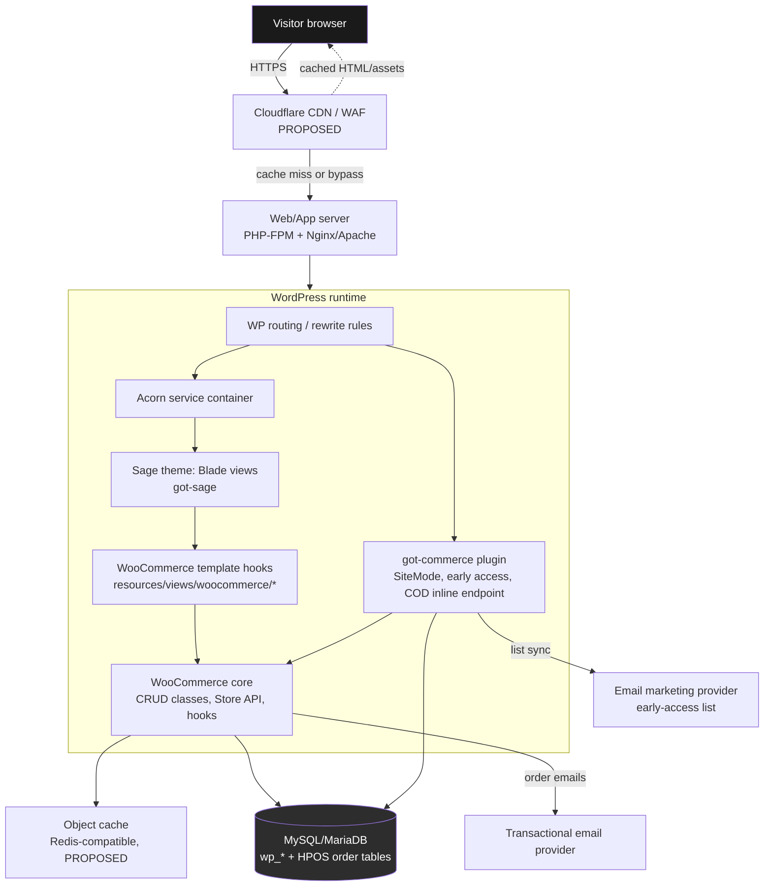

# System Overview

Status tags used throughout: **VERIFIED** (confirmed in this session from project documents), **PROPOSED** (reasoned recommendation, not live-checked against vendor release notes), **BLOCKED** (cannot proceed without owner input), **REQUIRES APPROVAL** (owner sign-off needed before implementation).

## 1. What this system is

GØT Store is a server-rendered WordPress + WooCommerce storefront. The theme (`got-sage`) is built on Roots Sage/Acorn/Blade/Vite/Tailwind/Alpine.js; business logic and persistence live in WordPress/WooCommerce core and a small companion plugin (`got-commerce`). **VERIFIED** — this is the explicit, non-negotiable architecture per the constitution (Commerce Principle 3, 7, 10) and `GOT-Store-PRD.md` §9 ("Non-Goals: Headless architecture (Next.js frontend)").

There is no headless API layer, no decoupled React/Next.js frontend, and no client-side source of truth for price, stock, or order state. The existing `GØT Design System (2)/ui_kits/storefront/*.jsx` files are **visual/behavioral reference only** — they are static, catalog-free design previews that explicitly refuse to submit real orders (see `checkout-flow.md` for the audit of what they do and don't do). They inform Blade markup and Alpine behavior; they are not ported as a React runtime.

## 2. Site modes

The storefront runs in exactly one of two modes at any time, controlled by a single WordPress option (PRD P0-F001):

- **Coming Soon mode** — pre-launch. Homepage renders the brand hero + early-access sign-up. No cart/checkout entry points in primary navigation.
- **Store mode** — full WooCommerce storefront (catalog, cart, checkout, account). Requires at least one published, in-stock product (server-enforced guard, not just UI).

The switch is a capability-gated admin setting (`got_manage_site_mode`, Administrator only per PRD), recorded in an activity log, and must clear relevant page caches on change. **VERIFIED** against PRD P0-F001 acceptance criteria. Whether direct `/shop/`, `/cart/`, `/checkout/` URLs stay reachable (but unlinked) during Coming Soon mode is an **open item** — PRODUCT.md §5 F02 flags this explicitly as "owner must approve this exposure policy before implementation." See `docs/adr/0002-headless-vs-traditional.md`'s sibling concern is not implicated here, but this exposure question is tracked as a standing **REQUIRES APPROVAL** item and should not be silently decided by the implementation team.

## 3. Request flow — visitor to database

Key properties:

- **Every response that can contain price, stock, or personal data is rendered server-side on each request** (or served from a short-TTL/private cache) — never baked into a long-lived public cache. This follows Commerce Principle 5 (never trust client totals) and PRODUCT.md §8 ("Do not cache personalized cart/checkout/account HTML publicly").
- Public, non-personalized pages (homepage, shop listing shell, static content pages) may sit behind full-page cache + CDN; WooCommerce fragments (cart count, mini-cart) are loaded via AJAX/Store API so the cached HTML shell stays valid for all visitors. **PROPOSED**, standard WooCommerce caching pattern.
- The `got-commerce` plugin never bypasses WooCommerce CRUD/Store API to write directly to `wp_wc_orders`/`wp_postmeta` — it calls `WC_Order`, `WC_Product`, `wc_create_order()`, etc., per Commerce Principle 6 (HPOS compatibility).

## 4. Deployment topology (summary — see `deployment.md` for detail)

Local → Staging → Production, Git-based deploys, CI build of theme assets (Vite), Composer-managed PHP dependencies, WooCommerce/WordPress database and uploads never pushed from local. Production changes require staging validation and explicit owner approval (Commerce Principles 18, 20).

## 5. Why this shape

- **Single source of truth.** WooCommerce owns products, inventory, orders, customers — this is non-negotiable per Commerce Principle 3, and it is what lets the inline PDP COD form (see `checkout-flow.md`) reuse the exact same stock/price/shipping/coupon logic as the standard checkout instead of re-implementing it.
- **No parallel runtime to keep in sync.** A headless/React frontend would require duplicating WooCommerce's cart/stock/price/tax logic client-side or proxying everything through a custom API layer — both rejected by the owner's brief and by Commerce Principle 8 (prefer WordPress-native solutions). See `docs/adr/0002-headless-vs-traditional.md`.
- **Theme/plugin boundary keeps upgrades safe.** Presentation (Blade/Tailwind/Alpine) and business logic (PHP services, hooks) are physically separated so a WooCommerce or Sage core update cannot silently break checkout logic. See `theme-plugin-boundaries.md`.

## 6. Open architecture questions tracked elsewhere

| Question | Where it's resolved |
|---|---|
| Sage 10 vs newer Sage line | `docs/adr/0001-sage-version.md` |
| Inline PDP COD mechanism (Store API vs custom endpoint vs native checkout hooks) | `docs/adr/0006-inline-checkout-architecture.md` |
| Wishlist persistence model | `docs/adr/0007-wishlist-persistence.md` |
| Hosting/caching provider | `docs/adr/0012-hosting-and-caching.md` |
| Coming Soon URL exposure policy | **REQUIRES APPROVAL**, tracked in `checkout-flow.md` and PRODUCT.md §11 |
