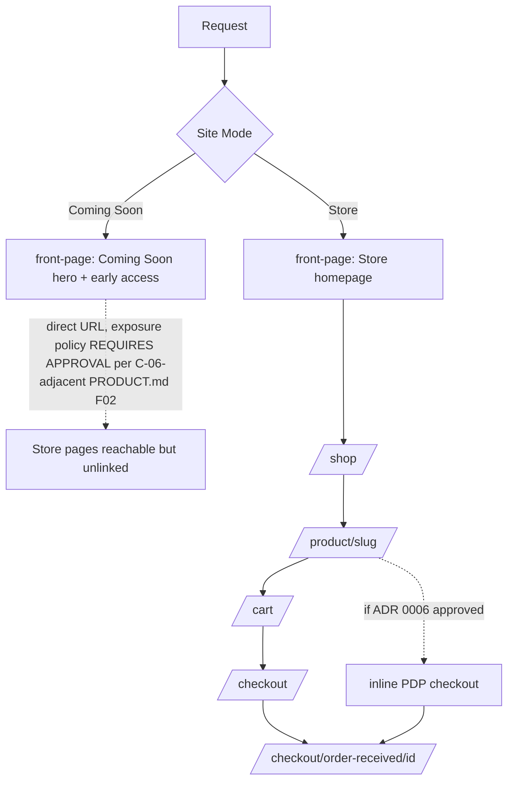

# Page Mapping — Prototype/PRD Pages → WordPress Templates

Cross-referenced against `docs/audit/page-inventory.md` (classification) and `PRODUCT.md` §4 (routes). Status: PROPOSED routing/template plan.

| Page | Route (per PRODUCT.md §4) | WordPress template | Owning feature | Source for layout |
|---|---|---|---|
| Coming Soon | `/` (when Site Mode = Coming Soon) | `front-page.php` (Blade: `front-page.blade.php`) branching on Site Mode, rendering editor/ACF content, never a hardcoded rebuild | Feature 005 | `ComingSoon.jsx` |
| Early access (standalone) | `/early-access/` | Ordinary WordPress Page template (`page-early-access.blade.php`) reusing the `EarlyAccessForm` component | Feature 005 | Hero section of `ComingSoon.jsx` (no standalone prototype page exists — see `docs/audit/page-inventory.md` #29) |
| Homepage (Store mode) | `/` (when Site Mode = Store) | `front-page.php` branching the other way, composed of the ACF Flexible Content blocks per ADR 0004 | Feature 006 | `Home.jsx`/`HomeSections.jsx`/`home-content.js` |
| Shop / listing | `/shop/` | `woocommerce/archive-product.php` override (Blade) | Feature 007 | `Shop.jsx` |
| Product category | `/product-category/{slug}/` | `woocommerce/taxonomy-product_cat.php` override, same grid/filter components as Shop | Feature 007 | **Extension requiring review** — no distinct prototype file exists; derive from `Shop.jsx`'s patterns per constitution ("derive from existing approved components," not a new identity) |
| Drop/collection page | *(no distinct PRODUCT.md route beyond product-category)* | Covered by product-category template with a "Drop 01" term; no separate template needed | Feature 007 | Homepage's "Featured Drop 01" section pattern |
| Product detail | `/product/{slug}/` | `woocommerce/single-product.php` override | Feature 008 | `Product.jsx` + `DirectCheckout.jsx` (inline checkout section gated on ADR 0006) |
| Cart | `/cart/` | `woocommerce/cart/cart.php` override | Feature 010 | **Extension requiring review** — no dedicated Cart page exists in the prototype (only `CartDrawer`); derive from `CartLine`/`OrderSummary` components, matching `Checkout.jsx`'s summary-column layout |
| Checkout (standard) | `/checkout/` | `woocommerce/checkout/form-checkout.php` override | Feature 010 | `Checkout.jsx` |
| Order received | `/checkout/order-received/{id}/` (WooCommerce-secured) | `woocommerce/checkout/thankyou.php` override | Feature 013 | `ThankYou.jsx` |
| My Account — dashboard shell | `/my-account/` | `woocommerce/myaccount/my-account.php` override | Feature 011 | `Account.jsx` (tab-switcher UI → WooCommerce's native endpoint-based account nav) |
| My Account — login/register | `/my-account/` (WooCommerce auth endpoints) | `woocommerce/myaccount/form-login.php` | Feature 011 | `Account.jsx` `mode === 'signin'/'register'` |
| My Account — password reset | WooCommerce lost-password endpoint | `woocommerce/myaccount/form-lost-password.php` | Feature 011 | `Account.jsx` `mode === 'reset'` |
| My Account — orders | `/my-account/orders/` | `woocommerce/myaccount/orders.php` | Feature 011 | `Account.jsx` `tab === 'orders'` |
| My Account — order detail | `/my-account/view-order/{id}/` | `woocommerce/myaccount/view-order.php` | Feature 011 | `Account.jsx`'s "View" action (currently routes to `Confirmation` in the prototype — production needs a real per-order detail view, not a shared tracking screen) |
| My Account — addresses | WooCommerce account endpoint | `woocommerce/myaccount/*-address.php` | Feature 011 | `Account.jsx` `tab === 'addresses'` |
| Wishlist | `/wishlist/` | Custom Blade page template (`page-wishlist.blade.php`), not a WooCommerce override (wishlist isn't native) | Feature 012 | `Wishlist.jsx` |
| Track order | `/track-order/` | Custom Blade page template | Feature 013 | `Confirmation.jsx` |
| Search | `/search/` or native WP search route | `search.php` override, reusing Shop's grid/filter components | Feature 007 | **Missing in prototype** — derive from `Shop.jsx` per ADR 0014 |
| About | `/about/` | Ordinary WordPress Page (`page.blade.php` default, or a dedicated `page-about.blade.php` if a distinct ACF layout is wanted) | Feature 015 | **Missing in prototype** — derive from DESIGN.md §7.10's described structure (manifesto, origin facts, packaging photography) |
| Contact | `/contact/` | Ordinary WordPress Page | Feature 015 | **Missing in prototype** — derive from DESIGN.md §7.10 |
| FAQ | `/faq/` | Ordinary WordPress Page, reusing the `Accordion` component | Feature 015 | **Partially present** — `Product.jsx`'s inline FAQ accordion is the pattern to reuse; no standalone page exists |
| Size guide | *(modal on PDP, not its own route)* | Stays a Blade `Modal` on the PDP, fed by real ACF/attribute-meta measurement data | Feature 008 | `Product.jsx`'s size-guide `Modal` |
| Shipping policy | `/shipping-policy/` | Ordinary WordPress Page | Feature 015 | **Missing in prototype** |
| Returns & exchanges | `/returns-exchanges/` | Ordinary WordPress Page | Feature 015 | **Missing in prototype** |
| Privacy policy | `/privacy-policy/` | Ordinary WordPress Page (WordPress's built-in privacy-policy page type) | Feature 015 | **Missing in prototype** |
| Terms and conditions | `/terms-and-conditions/` | Ordinary WordPress Page | Feature 015 | **Missing in prototype** |
| Cookie policy | `/cookie-policy/` | Ordinary WordPress Page | Feature 015 | **Missing in prototype** |
| 404 | *(error route)* | `404.php` override | Feature 015 | **Missing in prototype** — derive from DESIGN.md §7.10's "concise brand-aligned line, clear route back to Shop or early access depending on site mode" |

## Global template parts (apply to every applicable page, per constitution/HTML-to-Sage global-template-parts rule — never page-level ACF blocks)

`Header` (3 modes: store/minimal/checkout), `AnnouncementBar`, `Footer`, `CartDrawer`, theme no-flash bootstrap script, cookie-consent banner (ADR 0015).

## Site-mode-aware routing summary

