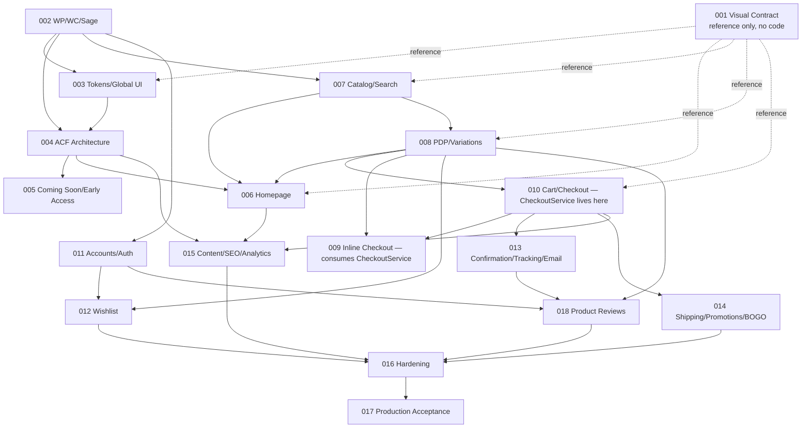

# Master Implementation Roadmap

**Status**: Planning artifact. Supersedes `docs/planning/master-roadmap.md` and `docs/planning/implementation-order.md` as the single authoritative execution sequence — those two documents remain as historical planning rationale, not contradicted by anything here. Covers **18 features** (001, and 002–018, the last added during an earlier audit to remediate finding C1 — Product Reviews).

**Updated 2026-10-09 (planning refactor)**: Feature 001 was retired as an independent implementation track and converted into a documentation/governance feature (`docs/planning/FEATURE-001-TASK-MIGRATION.md`). It has **zero implementation tasks** and therefore **no blocking edge** in the dependency graph below — it is consumed continuously by every other feature as a reference, not sequenced before them. The dependency graph and execution order were recalculated from scratch after this change, not blindly carried forward; see §2/§2a.

This is **planning only**. Nothing in this document authorizes starting implementation.

---

## 1. Feature Table

| # | Name | Business Objective | Exact Dependencies (hard) | Prerequisite Decisions | Main Deliverables | Integration Points | Required Tests | Acceptance Gate | Independently Developable? | Independently Deployable? |
|---|---|---|---|---|---|---|---|---|---|---|
| 001 | **GØT Master Conversion Contract & Visual Fidelity Baseline** (documentation/governance only, no code — refactored) | Single source of truth for prototype-element-to-feature ownership and the shared visual-fidelity procedure | None (not a blocking dependency of anything — a continuously-referenced artifact) | — | `docs/design/IMPLEMENTATION-VISUAL-CONTRACT.md`, `docs/planning/FEATURE-001-TASK-MIGRATION.md`, kept-current `docs/audit/source-conflicts.md` | Referenced (not depended on sequentially) by every feature that builds a visible page | Documentation-maintenance checks only (`specs/001/tasks.md` T001–T007) | `specs/001/spec.md` SC-001–SC-004 | Yes — has no code dependency on anything | N/A (nothing to deploy) |
| 002 | WordPress/WooCommerce/Sage Foundation | A real, working, CI-protected environment to build everything else on | **None** (001 is a reference, not a build prerequisite — this edge was removed during the recalculation) | ADR 0001, ADR 0012, ADR 0013 | Staging env, `got-sage`/`got-commerce` skeletons, CI pipeline, tax/currency/HPOS/Site-Mode config | Every later feature | Env smoke test, CI PR-check test | SC-001–SC-005 (`specs/002/spec.md`) | Yes — the actual root of the build graph | No (infra only) |
| 003 | Design Tokens and Global UI | Faithful, accessible dark/light theming and global chrome on every page | 002 | C-01 (Acid Lime, **RESOLVED — approved**) | Token CSS, Header×3 modes, Footer, AnnouncementBar, ThemeToggle, CartDrawer shell, RTL-logical-CSS audit | Every page-rendering feature below | Visual regression, axe-core, keyboard walkthrough | SC-001–SC-006 | Yes (after 002) | Yes, as a visual layer (no content yet) |
| 004 | ACF Content Architecture | Let a Content Editor compose/reorder pages without a developer | 002; soft: 003 | ADR 0004 (corrected) | 9 ACF Blocks composed natively in the block editor (**no Flexible Content field** — removed per finding C1-ARCH), Media Library seeding plan | 005, 006, 015 (all consume these blocks) | Manual admin QA per block | SC-001–SC-003 | Yes (after 002) | Yes |
| 005 | Coming Soon and Early-Access | Pre-launch lead capture with legally sound consent | 003, 004 | ADR 0010 (storage), ADR 0011 (email vendor — **open**) | `got_early_access` table, double-opt-in service, rate limiter, consent UI | 017 (list migration), 018 (shares no logic but same email-separation principle) | Playwright E2E, PHP unit (rate limiter, token) | SC-001–SC-005 | Yes (after 003/004) | **Yes — can go live alone in Coming Soon mode** |
| 006 | Homepage and Editorial Sections | Store-mode homepage that converts and never shows fake data | 004; soft: 007, 008 | — | 14-section homepage, **commerce sections now registered as real ACF Blocks** (corrected per finding C1-ARCH, not hardcoded Blade order), live WC queries, caching pattern | 007 (category/new-arrivals data), 008 (spotlight) | Visual regression, Lighthouse | SC-001–SC-004 | Partially (needs 007/008 for full data) | No (part of Store mode) |
| 007 | Product Catalog, Categories, Search | Buyers find products by browse/filter/search | 002 | ADR 0014 (search — resolved) | Shop/category templates, FilterBar, Load More, search | 006 (data), 008 (links to PDP) | Playwright E2E ×2 user stories | SC-001–SC-005 | Yes (after 002) | Yes, as catalog-only (no cart yet) |
| 008 | Product Detail, Variations, Inventory | Buyers select the exact variation and add to cart | 007 | — | PDP template, variation selectors, stock gating, JSON-LD | 006 (spotlight), 009 (inline checkout entry), 012 (wishlist), 014 (promo badges), 018 (rating display) | Playwright E2E ×2, a11y, schema validation | SC-001–SC-005 | Yes (after 007) | Yes, with "Add to cart" only (no checkout yet) |
| 009 | Inline PDP COD Checkout | Convert directly from the product page | 008, **010's `CheckoutService` validation methods (T006) + `IdempotencyGuard` (T003a) must be contract-stable first — see §3**; owner decision: **mandatory, resolved** | ADR 0006 (resolved, mechanism corrected) | Inline form, thin REST controller calling its own `wc_create_order()` (corrected — not a shared order-creation method), cart-isolation guarantee | Shares `CheckoutService`'s *validation* with 010; redirects to 013's confirmation page | Playwright E2E ×1 story + shared-service regression test | SC-001–SC-004 | **No — hard-blocked on 010's foundational phase** | No (own order-creation call, independent of 010's pipeline) |
| 010 | Cart and Standard Checkout | The core revenue path | 008 | ADR 0005, 0008 (resolved) | `CheckoutService` (shared **validation** only, corrected per finding C2-CHECKOUT), native Store API order creation, cart page, drawer (fully wired), checkout page, shipping zones | 009 (validation consumer, independent order-creation), 013 (confirmation/email), 014 (shipping/promo fee hooks) | Full order-lifecycle E2E suite, idempotency unit tests | SC-001–SC-005 | Yes (after 008) | **Yes — this is the minimum viable "real store"** |
| 011 | Customer Accounts and Auth | Repeat-purchase support, order ownership security | 002; soft: 010 (for testable order visibility) | — | Native WP/WC auth, lockout, non-enumeration | 012 (merge), 018 (verified-purchase check), 013 (order history reuse) | Security/authorization tests (non-negotiable) | SC-001–SC-004 | Yes (after 002) | Yes |
| 012 | Wishlist and Guest Merge | Retention; save-for-later | 008, ADR 0007; soft: 011 (merge half) | C-06 (guest-gate — **still open**, non-blocking) | Guest + user-meta storage, shared Alpine store, merge-on-login | 006 (spotlight hearts), 008 (PDP heart) | Playwright E2E ×2 stories | SC-001–SC-004 | Yes (after 008); merge sub-scope needs 011 | Yes (save/view sub-scope alone) |
| 013 | Order Confirmation, Tracking, Email | Buyer trust after purchase | 010; ADR 0011 (open); **ADR 0016 now resolves the Out-for-Delivery mapping (E1)** | ADR 0016 (resolved) | Confirmation page (shared by 009+010), 4 status emails, non-enumerating tracking lookup | 011 (account order history), 018 (7-days-after-Delivered trigger) | Playwright E2E, non-enumeration security test | SC-001–SC-004 | Yes (after 010) | Yes (confirmation half); tracking needs real orders |
| 014 | Shipping, Coupons, BOGO/Free-Shipping | Correct totals + owner-mandated promotions | 010; owner decision: **mandatory, resolved** | ADR 0009 (resolved, mechanism corrected) | Zone fees, native coupons, `got_promotion` CPT, `EligibilityCalculator`, **BOGO realized as a real zero-priced line item** (corrected per finding C3-PROMO, not a cart fee) | 006/008/010 (promo badge rendering surfaces) | Playwright E2E ×3 stories, boundary tests | SC-001–SC-004 | Yes (after 010) | Yes (shipping/coupon half); BOGO needs PDP+cart+checkout all wired |
| 015 | Content Pages, SEO, Analytics | Trust content + consent-respecting measurement | 004; soft: 006, 010 (event instrumentation) | ADR 0015 (resolved) | 8 content pages, consent banner, GTM gating, schema/sitemap | None structural — reads events from 006/008/010 | Network-level consent tests, event-fires-once test | SC-001–SC-004 | Yes (after 004) | Yes (pages half); analytics needs 006/010 live |
| 016 | Security, Accessibility, Performance Hardening | Launch-readiness gate | 002–015 (all) | — | 2FA, headers, axe-core sweep, Lighthouse, **load test at 10× baseline (newly added)** | Fixes route back into originating features | Full regression + security + a11y + load test | SC-001–SC-006 | No (by definition — audits everything else) | No (not a deployable unit, a gate) |
| 017 | Production Deployment and Acceptance | Safe, approved go-live | 016 | Owner's written launch-date approval | Prod provisioning, smoke test, backup-restore drill, early-access migration | All features, verified in production | Production smoke test, restore drill | SC-001–SC-004 | No | **No — this IS the deployment event** |
| 018 | Verified Product Reviews | Trust signal from real buyers | 013 (status-change hook), 011 (ownership) | — | Native WC reviews + verified gate, 7-day email scheduler, rating display | 008 (PDP/card rating display) | Playwright E2E ×2 stories | SC-001–SC-004 | Yes (after 011+013) | Yes |

---

## 2. Dependency Graph (topological, recalculated after the Feature 001 refactor)

Feature 001 is deliberately drawn with **dotted reference edges only** — it blocks nothing, because it has no code. Removing it from the solid-edge graph does not change the critical path at all, since it was never a real blocking prerequisite (confirmed by this recalculation, not merely asserted).

**Critical path** (longest hard-*blocking*-dependency chain, recalculated after removing 001's false blocking edge — the chain itself is unchanged in length because 001 was never actually on the critical path, it was only drawn first by number): `002 → 007 → 008 → 010 → 013 → 016 → 017` (7 hops, was miscounted as 8 in the pre-refactor version because it incorrectly included 001 as a sequential step). Feature 018 extends the graph but is not on the critical path (it depends on 011+013, both of which complete well before 016). **First executable feature: 002** — not 001, since 001 produces no code for 002 to build on.

### 2a. Correction found during this recalculation (artificial dependency removed)

The previous version of this graph included an edge `F013 → F011` ("Feature 013 blocks Feature 011"). **This edge had no basis in either feature's actual stated dependencies** — `specs/011-customer-accounts-auth/plan.md` and `spec.md` name only Feature 002 as a hard dependency (with 010 as a soft one, for testable order visibility); nothing in 011 depends on 013. The edge has been removed. No cycle existed either way (it was a redundant forward-pointing edge, not a back-edge), but it was still wrong and has been corrected rather than left in place — this is exactly the "artificial dependency" check requested for this round's validation, and it found a real instance.

**Full acyclicity check**: every edge in the graph above flows from a strictly-lower dependency tier to a strictly-higher one (traced by hand, edge by edge, after the correction above); no node has a path back to itself. No cycle exists.

## 3. The CheckoutService Question — Resolved, mechanism corrected 2026-10-09

**Question posed**: must the shared `CheckoutService` foundation (used by both Feature 009 and Feature 010) be implemented before either checkout flow, to avoid duplicate order-creation logic or rework?

**Answer: Yes for validation logic; no single shared order-creation call exists or should exist — see the correction below.**

An independent Codex architecture review (finding C2-CHECKOUT, `docs/planning/PRE-IMPLEMENTATION-ARCHITECTURE-REMEDIATION.md`) found that describing `CheckoutService` as the thing that calls `wc_create_order()` for *both* flows risks bypassing WooCommerce's own native Store API checkout processing for the cart-based flow. **Corrected model** (full detail: `docs/architecture/CHECKOUT-AND-ORDER-LIFECYCLE.md`):

- `CheckoutService` holds every shared **validation** rule (address/contact/stock/idempotency) — built in **Feature 010, Phase 2 (Foundational), Task T006**, with its idempotency dependency (`IdempotencyGuard`) now correctly built first, as **T003a** (moved from a defectively-late T023).
- Feature 010's own order is created by **WooCommerce's native Store API `/checkout` route**, extended via `woocommerce_store_api_checkout_update_order_from_request` (Task **T006a**) — never by `CheckoutService` itself.
- Feature 009's order is created by **its own direct `wc_create_order()` call** (Task **T008**), after calling `CheckoutService`'s validation methods — the one flow that legitimately needs to create its own order, since it has no cart/Store-API session to delegate to.
- **Practical consequence for execution order, corrected**: Feature 010's T006 (validation methods) and T003a (idempotency guard) must land and be contract-stable before Feature 009's T008 begins. Feature 009 does **not** depend on Feature 010's T006a (the Store API hook wiring) at all, since that's specific to the cart-based flow.

This still resolves the original rework risk (one implementation of every validation rule, never two) without the architectural problem the original wording introduced (a custom service shadowing WooCommerce's own order-creation pipeline).

## 4. What changed from the prior roadmap documents

- Feature 018 added (remediates C1).
- Feature 010's row and §3 above make the drawer-wiring fix (G1) and the CheckoutService-timing clarification (F2) explicit at the roadmap level, not just inside the feature's own tasks.md.
- Feature 016's row reflects the newly-added load-test task (found missing during this audit, not previously reported).
- Feature 003's row reflects the newly-added RTL-logical-CSS audit task (found missing during this audit, not previously reported).
- Feature 002's row reflects the newly-added tax-configuration task (found missing during this audit, not previously reported).

### 2026-10-09, this round (architecture remediation via independent Codex review)

- Feature 004/006 rows reflect the ACF Flexible Content field's removal (finding C1-ARCH) — composition is now purely native-block-editor-based.
- Feature 009/010 rows and §3 above are rewritten to reflect the corrected checkout model: `CheckoutService` is validation-only; order creation is split by flow (native Store API for 010, direct `wc_create_order()` for 009) (finding C2-CHECKOUT).
- Feature 014's row reflects BOGO's corrected mechanism (a real zero-priced line item, not a cart fee) (finding C3-PROMO).
- Full findings register: `docs/planning/PRE-IMPLEMENTATION-ARCHITECTURE-REMEDIATION.md`.

## 5. Explicit Launch-Readiness Reading

Per `docs/planning/release-scope.md` (unchanged): Features 002, 003, 004, 005, 006, 007 (catalog only), 008, 009 (now mandatory), 010, 014 (shipping/coupon half, now BOGO/free-shipping also mandatory) are the v1 launch-blocking set. 011, 012, 013 (tracking half), 015, 018 are Should-Have with an explicit owner-approved slip allowance per PRD. 016 and 017 gate the actual go-live regardless of which optional items made the cut.
