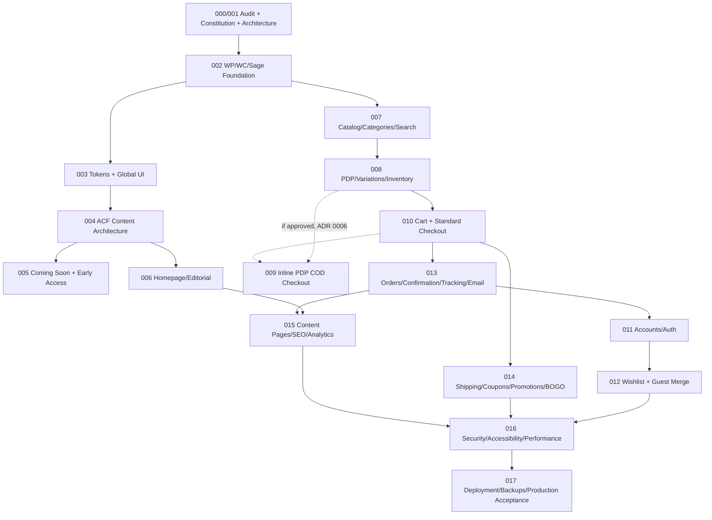

# Master Roadmap

**Superseded for execution purposes by `docs/planning/MASTER-IMPLEMENTATION-ROADMAP.md`**, which covers the full 18-feature set with real Spec Kit artifacts, a recalculated/corrected dependency graph, and per-feature deployability analysis. Kept here as the original pre-Spec-Kit planning rationale.

Eighteen planning-feature slices (000/001 through 017), refined from the original proposed sequence against the real dependencies found in `GOT-Store-PRD.md`'s own 4-phase, 8-week plan (§10) and the source audit. **000/001 is already done** (this planning session's own output); 002–017 are PROPOSED feature briefs in `docs/planning/feature-briefs/`, not yet run through the real Spec Kit `/speckit.specify → /plan → /tasks` cycle — that happens one feature at a time, starting when the owner approves moving from planning to implementation.

| # | Feature | PRD phase alignment | Status |
|---|---|---|---|
| 000/001 | Project audit, constitution, architecture decisions, WordPress/WooCommerce/Sage foundation planning | N/A — this planning session | **DONE** (`specs/001-got-woocommerce-storefront/`, this `docs/` tree, `.specify/memory/constitution.md`) |
| 002 | WordPress, WooCommerce, Sage foundation (install/provision) | Phase 1 | PROPOSED |
| 003 | Design tokens and global UI (Header/Footer/AnnouncementBar/ThemeToggle) | Phase 1 | PROPOSED |
| 004 | ACF content architecture and editable sections | Phase 1–2 | PROPOSED |
| 005 | Coming Soon and early-access workflow | Phase 1 | PROPOSED |
| 006 | Homepage and editorial sections | Phase 2 | PROPOSED |
| 007 | Product catalog, categories, filters, search | Phase 2 (catalog) + Phase 3 (search, P1-F003) | PROPOSED |
| 008 | Product details, variations, inventory | Phase 2 | PROPOSED |
| 009 | Product-page inline COD checkout | **Not in PRD phase plan at all — gated on ADR 0006/C-02 approval** | PROPOSED, BLOCKED on scope decision |
| 010 | Cart and standard WooCommerce checkout | Phase 2 | PROPOSED |
| 011 | Customer accounts and authentication | Phase 3 (P1-F001) | PROPOSED |
| 012 | Wishlist and guest-to-account merge | Phase 3 (P1-F004) | PROPOSED |
| 013 | Orders, confirmation, tracking, email | Phase 2 (confirmation/email) + Phase 3 (tracking, P1-F002) | PROPOSED |
| 014 | Shipping, coupons, promotions, BOGO | Phase 2 (shipping/coupons) + **BOGO gated on ADR 0009/C-03** | PROPOSED, partially BLOCKED |
| 015 | Content pages, policies, SEO, analytics | Phase 3 (P1-F006, P1-F007) | PROPOSED |
| 016 | Security, accessibility, performance, observability | Phase 4 | PROPOSED |
| 017 | Deployment, backups, recovery, production acceptance | Phase 4 | PROPOSED |

## Sequencing diagram

## What changed from the originally proposed sequence, and why

- **009 (inline PDP checkout)** is placed *after* 008 and 010, not interleaved earlier, because it architecturally depends on both the product-variation data (008) and the shared checkout service (010) existing first (ADR 0006) — and it remains explicitly gated on an unresolved scope conflict (C-02), so it may not execute at all in v1.
- **014's BOGO scope** is split from its shipping/coupon scope — shipping zones and native coupons are firmly in PRD Phase 2/P0 scope; BOGO is not in the PRD at all and is gated on ADR 0009/C-03.
- **013 straddles two PRD phases** (order confirmation/email is core Phase 2 scope; order *tracking* is Phase 3/P1) because the prototype and PRD both treat them as one coherent "order lifecycle" concern — split further in the feature brief's own task breakdown, not at the roadmap level.

## Launch-readiness framing

Per PRD §3 Success Definition, the project is "successful" at Drop 01 going live in Store mode with ≥1 completed COD order and zero open Critical/High defects on the **Must Have (P0)** set — i.e., features 002, 003 (partial), 004 (partial), 005, 006, 007 (catalog only, not search), 008, 010, and 016/017's hardening gate. Features 009, 011, 012, 013 (tracking portion), 014 (BOGO portion), and 015 are P1/conditional and tracked in `docs/planning/release-scope.md`.
