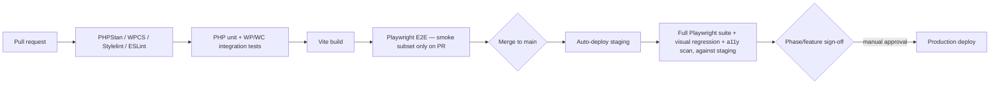

# Test Strategy

Status: PROPOSED. Grounded in `GOT-Store-PRD.md` §9 ("Testing: PHPUnit for custom service classes, Playwright end-to-end tests for checkout, cart, sign-up, and theme toggle; manual device testing before launch") and the constitution's testing/regression-prevention governance clauses. This is a plan, not an executed test run — no claim here should be read as "already passing."

## Layers and tooling

| Layer | Tool (PROPOSED) | Scope |
|---|---|---|
| PHP unit tests | Pest or PHPUnit | `got-commerce` service classes (checkout business-rule service, wishlist merge logic, early-access validation, Site Mode guard) — pure PHP logic, no WordPress bootstrap needed where avoidable. |
| WordPress integration tests | `WP_UnitTestCase` (WordPress core test suite) | Hooks/filters registration, capability checks, custom REST endpoint `permission_callback`s, Site Mode option read/write. |
| WooCommerce integration tests | WooCommerce's own test helpers (`WC_Unit_Test_Case` or equivalent) | Order creation via `wc_create_order()`, stock reduction, HPOS compatibility, coupon validation — run against a real WooCommerce test database, never mocked (per this project's own stated lesson: don't mock the database for checkout-critical logic). |
| API contract tests | Pest/PHPUnit HTTP test client, or Postman/Newman collection | Custom `/api/v1/*` endpoints (early-access, order tracking) — request/response shape, auth/rate-limit behavior, error-response shape. |
| Frontend component tests | Manual/visual only — **no dedicated JS component test framework is proposed**, since production ships no React/JS component library (ADR 0002/0003); Alpine.js islands are thin enough that E2E coverage (below) is the appropriate test level, not unit tests of Alpine directives. | — |
| Playwright E2E | Playwright (explicitly named in PRD §9) | Full user journeys — see `docs/testing/commerce-test-matrix.md` for the complete scenario list. |
| Accessibility tests | axe-core (automated, in CI) + manual screen-reader pass (VoiceOver/NVDA) before each phase gate | WCAG 2.1 AA, both themes, all breakpoints. |
| Visual regression tests | See `docs/testing/visual-regression-plan.md` | 100% visual parity enforcement against the design-system reference. |
| Security checks | Dependency/vulnerability scan (e.g. `composer audit`, WPScan or equivalent) + manual review of every custom endpoint's `permission_callback` and nonce usage | Per constitution security-architecture requirement. |
| Performance tests | Lighthouse CI + a synthetic mid-range-Android/4G profile | Core Web Vitals targets (PRD §8). |
| Order lifecycle tests | A dedicated E2E suite distinct from generic "checkout" tests — covers status transitions, email triggers, tracking lookup, stock reduction timing | See `docs/testing/commerce-test-matrix.md`. |

## CI gating flow

Only a fast "smoke" subset of Playwright scenarios runs on every PR (to keep CI feedback fast); the full E2E + visual-regression + accessibility suite runs against staging after merge, before any phase-gate sign-off per `docs/architecture/deployment.md`.

## Mapping to the constitution's quality gates

Every feature brief in `docs/planning/feature-briefs/` lists its own "Testing Requirements" — this document is the toolbox those requirements draw from, not a duplicate list. A feature cannot be marked done without its specified layer(s) above actually passing, per constitution Principle 12 ("every feature requires appropriate automated testing").

## What this project deliberately does NOT need

- No dedicated visual-diffing SaaS subscription is assumed by default (budget-sensitive, single-brand project) — `docs/testing/visual-regression-plan.md` proposes an open-source-first approach, flagged REQUIRES APPROVAL if a paid tool is preferred instead.
- No load-testing-as-a-service beyond a single pre-launch drop-day simulation (PRD's own stated scale doesn't justify continuous load testing infrastructure).
