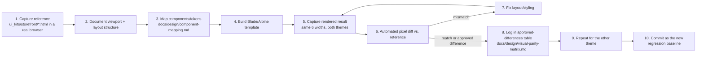

# Visual Regression Plan

Status: PROPOSED. Implements the capture → render → diff workflow required by DESIGN.md §10 and the constitution's visual-parity-first principle, operationalizing `docs/design/visual-parity-matrix.md`'s checklist into an actual repeatable test process.

## Workflow

## Required breakpoints and states (per DESIGN.md §10, VERIFIED)

Widths: **360, 390, 768, 1024, 1440, 1920px**. Themes: dark + light. States to additionally capture at a representative subset of breakpoints: modal/drawer-open, empty, error, loading, success.

## Tooling (PROPOSED — open-source-first per `docs/testing/test-strategy.md`)

- **Capture**: Playwright's own screenshot API (already in the stack for E2E, per PRD §9) — avoids adding a second browser-automation tool just for visual capture.
- **Diffing**: `pixelmatch`/`odiff`-style pixel-diff library integrated into the Playwright test run, with a tolerance threshold tuned per-page (text-heavy pages need a looser anti-aliasing tolerance than solid-color blocks).
- **Baseline storage**: committed alongside the test suite in the repository (small PNGs per breakpoint/theme/state), reviewed in PR diffs like any other code change — avoids a paid SaaS dependency by default. **REQUIRES APPROVAL** if the team prefers a hosted visual-review tool (e.g. Percy/Chromatic-equivalent) instead, which offers a nicer reviewer UI at a recurring cost.

## How this avoids false positives (flaky visual tests)

- Reduced-motion is forced on during capture (matches the `prefers-reduced-motion` test profile already required by DESIGN.md §8) so animation timing never causes a capture-moment mismatch.
- Font loading is awaited (`document.fonts.ready`) before every capture, since self-hosted-font FOUT/FOIT timing is a common source of flaky visual diffs.
- Dynamic content (e.g. "last viewed X minutes ago," if ever added) is explicitly out of scope for pixel-diffing and would need a masked region — not relevant to the current v1 scope, flagged for future awareness only.

## How "approved differences" work

When a deliberate, owner-approved deviation from the reference exists (e.g. a genuinely improved spacing fix the brand owner signs off on), it is recorded in `docs/design/visual-parity-matrix.md`'s "Approved differences log" table **and** the new rendered state becomes the new baseline — the diff tool is never silently told to "ignore" a region without this paper trail, per the constitution's "visual mismatch is a failed task" rule (an undocumented silent ignore is itself a mismatch).

## Relationship to `docs/design/visual-parity-matrix.md`

That document defines *what* parity means and the per-page checklist; this document defines *how* it's mechanically tested and *with what tools*. Neither replaces the other.
